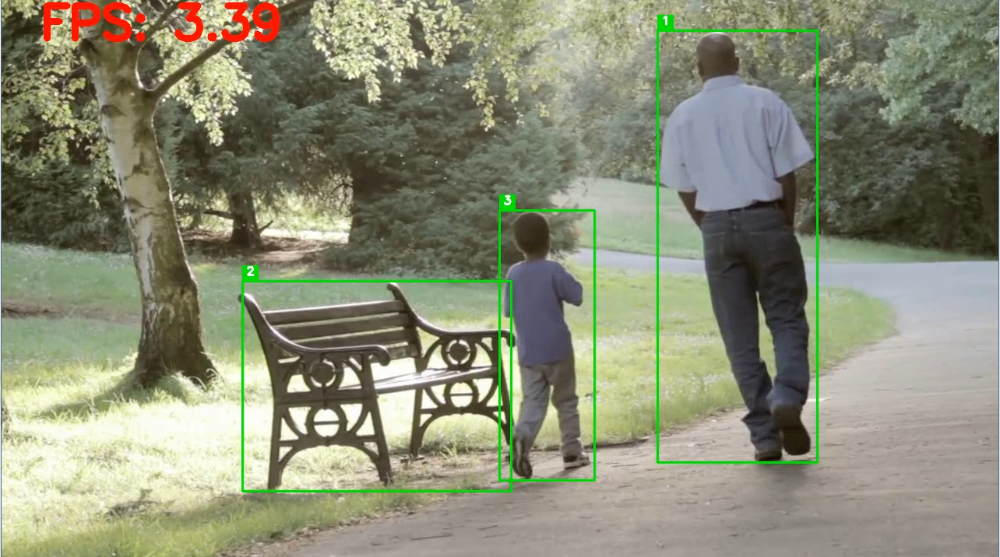

<!-- paginate : skip-->

# 
Zwischenpräsentation

## 
Stagelight

Julian Burner, Kevin Forst, Maxi Endl, Maxim Udod

---
<!-- footer : "Stagelight - Zwischenpräsentation" -->
<!--paginate : true-->

# 
Gliederung

- Motivation und Ideenfindung
- Konzeptuelle Umsetzung
- Technische Umsetzung
- Momentaner Stand
- Fazit und Ausblick

---

# 
Motivation und Ideenfindung

- Grundidee von einem Kommilitonen aus dem Studiengang Medientechnik
- Bedarf an kostengünstiger Scheinwerferausichtungslösung
- Einsatz bei Doschauher-TV etc.

---

# 
Bezug zur Nachhaltigkeit

SDGs:
- [Goal 9](https://sdgs.un.org/goals/goal9):
  > Develop [...] infrastructure [...] with a focus on affordable and equitable access for all.
- [Goal 12](https://sdgs.un.org/goals/goal12):
  > Substantially reduce waste generation through prevention, reduction, recycling and reuse.

---

# 
Konzeptuelle Umsetzung

- Schwenkbare Scheinwerfer
- Am mittleren Scheinwerfer montierte Kamera
- Kabellose Übertragung der Bewegtbilder an PC
- Python-Programm:
  - Objekterkennung
  - Objektauswahl durch Nutzereingabe
  - Verfolgung des Objekts im Videostream
  - Automatische Ausrichtung der Scheinwerfer

---

# 
Technische Umsetzung

- Scheinwerfer: T1 Profile
- Kamera: ?
- Software:
  - Python
  - OpenCV für Videoeingabe
  - YOLO-Modell für Objekterkennung

---

# 
Momentaner Stand

- Zugriff auf Hardware als limitierender Faktor
- Lego Mindstorms als Testplattform?
- Software:
  

---

# 
Fazit und Ausblick

Schwerer als gedacht um geeignete Software zu finden/entwickeln um Objekte/Personen zu verfolgen.

---

# 
GitHub Repo

[https://github.com/exiidor/Stagelight](https://github.com/exiidor/Stagelight)

